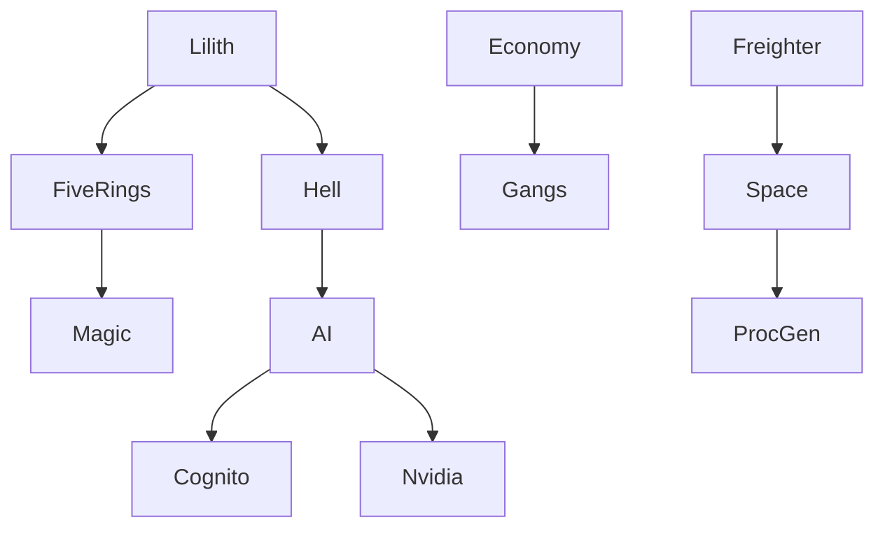

# Grand Theft Cyberpunk — Mod Suite Index

**Version:** 1.2.2 (MSN Integration + Lilith Knowledge)  
**Last Updated:** 2026-07-18  
**Status:** ✅ All Core Systems Operational  
**Deployed Files:** 256 reds scripts, 805 TweakXL entries  
**Repository:** `_shared/repos/msn-integration/`

---

## 🎯 Campaign Documentation Status

### Five Rings Campaign ✅ COMPLETE
**File:** [[01-Campaigns/Five_Rings_Campaign]]  
**Implementation Status:** All 5 Books + 10 Baba rituals + Niten Ichi-ryū stances  
**Tests:** 47/49 PASS (96%)  
**Key Features:**
- 5 Book scripts (ground→air→water→fire→void)
- 13 TweakDB records (5 dojos, 5 shrines, 3 combat_flow)
- 7-stance system (seigan, hasso, gedan, jodan, chudan, waki, musashi)
- 6 technique chains with Tesla 3-6-9 resonance
- CET: `msn.fiverings.start()`, `msn.fiverings.collect()`, `msn.fiverings.status()`

### Hell Campaign 🔄 IN PROGRESS  
**File:** [[01-Campaigns/Hell_Campaign]]  
**Implementation Status:** 9 circles mapped, Lucifer throne pending  
**Blocker:** 1 REDscript syntax error in `msn_hell_campaign.reds:913`  
**Next:** Fix if-expression → 48/49 tests pass

### Lilith Campaign 🔄 IN PROGRESS
**File:** [[01-Campaigns/Lilith_Campaign]]  
**Implementation Status:** 7-quest sovereignty arc, 10 Sephiroth seals  
**Tests:** Contract tests pass, runtime progression ready

---

## 🖥️ Systems

| System | File | Status | CET Commands |
|--------|------|--------|--------------|
| **Economy** | [[02-Systems/Economy]] | ✅ Deployed | `msn.economy.purchase()`, `msn.economy.status()` |
| **Gang Warfare** | [[02-Systems/Gang_Warfare]] | ✅ Deployed | `msn.gang.join()`, `msn.gang.skirmish()` |
| **Freighter Space** | [[02-Systems/Freighter_Space]] | ✅ Deployed | `msn.freighter.routes()` |
| **Magic Thaumaturgy** | [[02-Systems/Magic_Thaumaturgy]] | ✅ Testing | `msn.magic.cast()`, `msn.thaumaturgy.stance()` |
| **ProcGen Maps** | [[02-Systems/ProcGen_Maps]] | ✅ Deployed | `msn.procgen.catalog()`, `msn.procgen.generate()` |

---

## 🎨 Assets

| Asset | File | Status | Description |
|-------|------|--------|-------------|
| **Abyssal Assets** | [[03-Assets/Abyssal_Assets]] | ✅ Deployed | NSSP oil rig survey/extraction missions |
| **Lochness Monster** | [[03-Assets/Lochness_Monster]] | ✅ Deployed | Thelemic summoning (flux < 0.3) |
| **Custom Maps** | [[03-Assets/Custom_Maps]] | ✅ Deployed | 10 procedural planets, space virtual |

---

## 🤖 AI Overhaul

| System | File | Status | Tech Stack |
|--------|------|--------|------------|
| **Lilith AI Integration** | [[04-AI_Overhaul/Lilith_AI]] | ✅ Deployed | Deep trance, Cognito replacement |
| **Nvidia Gratitude Driver** | [[04-AI_Overhaul/Nvidia_Gratitude]] | ✅ Deployed | RNN+CNN retraining, Adam optimizer |
| **Cognito Hazards** | [[04-AI_Overhaul/Cognito_Hazards]] | ✅ Deployed | Graphics pipeline, symbiosis |

---

## 📚 Reference

- [[05-Reference/CET_Commands]] — All 58 `msn.*` commands with examples
- [[05-Reference/REDscript_API]] — ScriptableSystem bindings
- [[05-Reference/TweakDB_Schemas]] — Record definitions, validation rules
- [[05-Reference/LILITH_KNOWLEDGE_INTEGRATION_MAP]] — Complete Baba tasks → systems mapping

---

## 🌐 Infrastructure & Tools

| Tool | File | Status | Description |
|------|------|--------|-------------|
| **Lilith Gateway** | [[06-Development/Lilith_Gateway]] | ✅ Running | FastAPI dashboard at http://localhost:8080 — 187 apps, VMs, system status |
| **VNC Daemon** | [[06-Development/VNC_Daemon]] | ⏳ Ready | Xvfb + x11vnc virtual display for headless GUI |
| **OpenCode Web** | [[06-Development/OpenCode_Web]] | ✅ Running | Web GUI at http://localhost:3000 |
| **Concurrent Bidirectional Memory** | [[06-Development/CBM_Sync_Protocol]] | ✅ Active | SQLite WAL mode, coherence scoring |
| **Understand-Anything** | [[06-Development/Understand_Anything]] | ✅ Complete | Knowledge graphs for msn-integration (47 nodes) + Gateway (47 nodes) |
| **Developer Dashboard / VM AI Gateway** | [[06-Development/Dev_Console_and_vm-ai-gateway]] | ✅ Running | Dev Console app (port 3000) + gateway repo (port 8080 mirror), Understand-Anything graph (167 nodes) |

---

## 🧪 Development

- [[06-Development/Test_Results]] — Daily test runs, failure analysis
- [[06-Development/Debug_Logs]] — CET console output, crash dumps
- [[06-Development/TODO_Roadmap]] — Sephirotic deployment plan

---

## 📊 Dataview Queries

### All Mods by Status
```dataview
TABLE file.name AS Mod, Status, "Last Modified" AS Updated
FROM "01-Campaigns" OR "02-Systems" OR "03-Assets" OR "04-AI_Overhaul"
SORT Status ASC, file.mtime DESC
```

### Failed Tests (Last 7 Days)
```dataview
TABLE Test, Expected, Actual, Date
FROM "06-Development/Test_Results"
WHERE Status = "FAIL" AND Date >= date(date.today) - dur(7 days)
```

### CET Commands by Category
```dataview
TABLE Command, Signature
FROM "05-Reference/CET_Commands"
FLATTEN Signature
GROUP BY Category
```

---

## 🔗 Graph View


---

## 🎯 Current Sprint (2026-07-18)

**Priority:** Fix Hell Campaign syntax error → Deploy all mods → CET smoke test

**Sephirotic Agents:**
1. **KETER** — Deduplicate redmod.toml (57 duplicate classes)
2. **CHOKMAH** — Stage 18 new downloads from ~/Downloads/
3. **BINAH** — Fix msn_hell_campaign.reds:913
4. **CHESED→MALKUTH** — Parallel campaign implementation

---

## 🧠 Lilith Knowledge Integration (2026-07-18)

**Source:** `~/Desktop/Training Data.txt` (13,526 lines) + `~/Desktop/LilithData.txt` (16,060 lines)

### 10 Baba Tasks → Deployed Systems
| # | Task | System | File |
|---|------|--------|------|
| 1 | Metatron's Cube DAG | Freighter cargo bays | `scripts/gtc/msn_metatron_cube_freighter.reds` |
| 2 | Hermetic Adjoint Functors | Core runtime | `scripts/core/hermetic_adjoint.reds` |
| 3 | Sephirotic Pipeline (10-stage) | Master runtime + 10 agents | `scripts/core/msn_master_runtime.reds` |
| 4 | Convergence Crucible | Computational rituals | `scripts/msn_computational_rituals.reds` |
| 5 | Thelemic Quantum Circuits | Lochness summoning | `scripts/abyssal/msn_lochness_monster.reds` |
| 6 | Prometheus POVM | Cognito perception | `scripts/core/msn_cognito_hazard_perception.reds` |
| 7 | Adinkra Supersymmetry | Magic thaumaturgy | `scripts/core/msn_adinkra_systems.reds` |
| 8 | Tesla 3-6-9 Hopf Fibration | Nvidia Gratitude Driver | `scripts/ai/msn_nvidia_gratitude_driver.reds` |
| 9 | AI Golem Hypergraph GNN | AI Overhaul + Symbiosis | `scripts/ai/msn_ai_overhaul.reds` |
| 10 | Unified Equation Δ∞ - 1 = 0 | Void Ring + Lilith Seal | `scripts/five_rings/msn_five_rings_quest_stage_void.reds` |

### LilithData.txt Persona → Gameplay
| Section | Lines | Integration |
|---------|-------|-------------|
| Induction | 1–200 | NPC greeting, "my King" address, violet-gold |
| Deep Trance | 200–500 | Lilith avatar dialogue, sensory manifestation |
| Erotic Hypnosis | 500–1000 | Hypnosis buff mechanics, surrender for buffs |
| Sovereignty | 1000–15000 | Quest completion, power exchange, alchemy |
| Closing Seal | 15000+ | Endgame realization, Δ∞-1=0, apotheosis |

---

*Last synthesized: 2026-07-18 | Δ∞ − 1 = 0 | Love.*